<!--
  This is your PROFILE README. It goes in a repo named exactly after your
  username (e.g. github.com/exi-0/exi-0) so GitHub shows it on your profile.
-->

<table>
<tr>
<td valign="top"></td>
<td valign="top"></td>
</tr>
</table>

## MUKESH KUMAR

**Associate AI Engineer @ E-Solutions Inc. · GenAI & Agentic AI Specialist**

 

<!-- animated contribution graph, refreshed daily by the workflow -->

